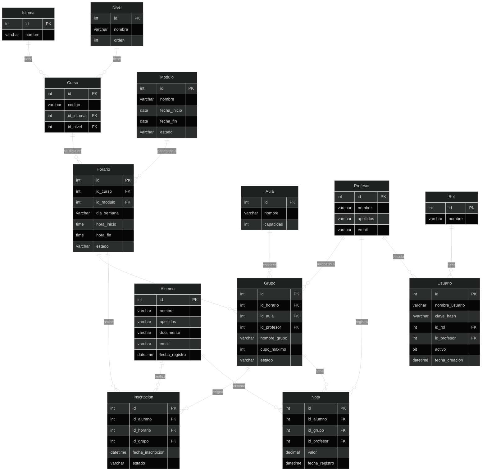

# Modelo relacional – Escuela de Idiomas Babel

**Caso #8 – PUDS – Modelo de diseño (base de datos lógico/físico)**

---

## Diagrama entidad-relación (tablas y relaciones)

---

## Tablas y atributos

### Catálogos

| Tabla | PK | Atributos | Descripción |
|-------|-----|-----------|-------------|
| **Idioma** | id | nombre | Inglés, Alemán, Francés. |
| **Nivel** | id | nombre, orden | Básico(1), Medio(2), Alto(3). Orden define prioridad en asignación. |
| **Curso** | id | codigo, id_idioma, id_nivel | 9 cursos (I-B, I-M, I-A, A-B, A-M, A-A, F-B, F-M, F-A). |
| **Aula** | id | nombre, capacidad | 12 aulas; capacidad = 16. |

### Personas

| Tabla | PK | Atributos | Descripción |
|-------|-----|-----------|-------------|
| **Alumno** | id | nombre, apellidos, documento, email, fecha_registro | Estudiantes. |
| **Profesor** | id | nombre, apellidos, email | Docentes que registran notas. |

### Autenticación

| Tabla | PK | Atributos | Descripción |
|-------|-----|-----------|-------------|
| **Rol** | id | nombre | Tipos de usuario: Administrativo, Profesor. |
| **Usuario** | id | nombre_usuario, clave_hash, id_rol, id_profesor, activo, fecha_creacion | Login del sistema; id_profesor opcional (vinculación con Profesor). |

### Organización temporal

| Tabla | PK | Atributos | Descripción |
|-------|-----|-----------|-------------|
| **Modulo** | id | nombre, fecha_inicio, fecha_fin, estado | Periodo lectivo (abierto/cerrado). |
| **Horario** | id | id_curso, id_modulo, dia_semana, hora_inicio, hora_fin, estado | Cuándo se dicta un curso en un módulo. |

### Inscripciones y grupos

| Tabla | PK | Atributos | Descripción |
|-------|-----|-----------|-------------|
| **Grupo** | id | id_horario, id_aula, id_profesor (opc.), nombre_grupo, cupo_maximo, estado | Grupo asignado a un aula; id_profesor identifica al profesor que evalúa el grupo (solo él puede cargar notas). Si no hay profesor asignado, estado = 'cerrado' (asignación automática cierra grupos sin profesor). |
| **Inscripcion** | id | id_alumno, id_horario, id_grupo, fecha_inscripcion, estado | Inscripción; id_grupo se llena tras asignar aulas. |

### Evaluación

| Tabla | PK | Atributos | Descripción |
|-------|-----|-----------|-------------|
| **Nota** | id | id_alumno, id_grupo, id_profesor, valor, fecha_registro | Calificación por alumno en un grupo. |

---

## Relaciones y cardinalidad

| Desde | Hacia | Tipo | Observación |
|-------|--------|------|-------------|
| Idioma | Curso | 1:N | Un idioma tiene muchos cursos. |
| Nivel | Curso | 1:N | Un nivel tiene muchos cursos. |
| Curso | Horario | 1:N | Un curso se dicta en varios horarios (por módulo). |
| Modulo | Horario | 1:N | Un módulo tiene muchos horarios. |
| Horario | Grupo | 1:N | Un horario puede generar varios grupos (si se parte en 2). |
| Aula | Grupo | 1:N | Un aula puede albergar grupos en distintos horarios. |
| Profesor | Grupo | 1:N | Un profesor puede estar asignado a varios grupos (uno por grupo en la asignación automática). |
| Alumno | Inscripcion | 1:N | Un alumno tiene muchas inscripciones. |
| Horario | Inscripcion | 1:N | Un horario recibe muchas inscripciones. |
| Grupo | Inscripcion | 1:N | Un grupo tiene muchas inscripciones (alumnos asignados). |
| Alumno | Nota | 1:N | Un alumno tiene muchas notas. |
| Grupo | Nota | 1:N | Un grupo tiene muchas notas (una por alumno). |
| Profesor | Nota | 1:N | Un profesor registra muchas notas. |
| Rol | Usuario | 1:N | Un rol tiene muchos usuarios. |
| Profesor | Usuario | 1:N | Un profesor puede tener un usuario de acceso (id_profesor en Usuario). |

---

## Restricciones de integridad

- **UNIQUE (Alumno, Horario)** en Inscripcion: un alumno no se inscribe dos veces al mismo horario (RN11).
- **UNIQUE (Alumno, Grupo)** en Nota: una sola nota por alumno por grupo.
- **CHECK** (opcional): capacidad de Aula = 16; cupo_maximo en Grupo ≤ 16; estado en Grupo ('activo', 'cerrado').
- **Asignación automática (SP):** tras crear grupos, se asigna un profesor a cada grupo por orden; los grupos que no reciben profesor se cierran (estado = 'cerrado').
- **Capacidad (Aula) vs cupo_maximo (Grupo):** no es redundancia. *capacidad* es la capacidad física del aula; *cupo_maximo* es el límite asignado a ese grupo al crearlo (16 si es grupo único, 8 si el horario se partió en dos). Ver `Normalizacion.md`.

