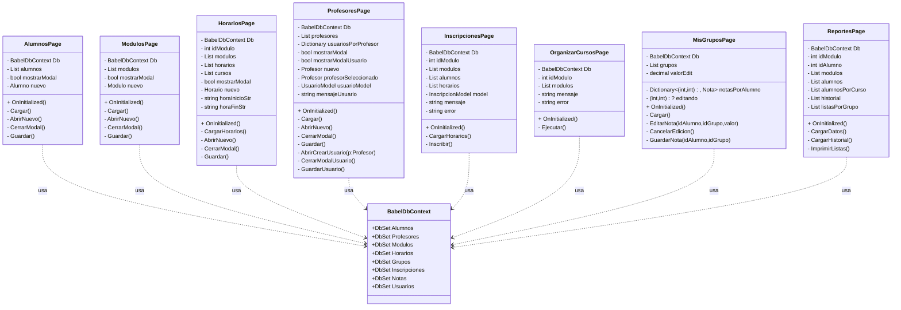

## Diagrama de clases de diseño – Páginas principales (simplificado)

```mermaid
classDiagram

%% Diagrama sin clases de infraestructura (AuthService, NavigationManager, IJSRuntime)

class BabelDbContext {
  +DbSet<Alumno> Alumnos
  +DbSet<Profesor> Profesores
  +DbSet<Modulo> Modulos
  +DbSet<Horario> Horarios
  +DbSet<Grupo> Grupos
  +DbSet<Inscripcion> Inscripciones
  +DbSet<Nota> Notas
  +DbSet<Usuario> Usuarios
}

class AlumnosPage {
  - BabelDbContext Db
  - List<Alumno> alumnos
  - bool mostrarModal
  - Alumno nuevo
  + OnInitialized()
  - Cargar()
  - AbrirNuevo()
  - CerrarModal()
  - Guardar()
}

class ModulosPage {
  - BabelDbContext Db
  - List<Modulo> modulos
  - bool mostrarModal
  - Modulo nuevo
  + OnInitialized()
  - Cargar()
  - AbrirNuevo()
  - CerrarModal()
  - Guardar()
}

class HorariosPage {
  - BabelDbContext Db
  - int idModulo
  - List<Modulo> modulos
  - List<Horario> horarios
  - List<Curso> cursos
  - bool mostrarModal
  - Horario nuevo
  - string horaInicioStr
  - string horaFinStr
  + OnInitialized()
  - CargarHorarios()
  - AbrirNuevo()
  - CerrarModal()
  - Guardar()
}

class ProfesoresPage {
  - BabelDbContext Db
  - List<Profesor> profesores
  - Dictionary<int,string> usuariosPorProfesor
  - bool mostrarModal
  - bool mostrarModalUsuario
  - Profesor nuevo
  - Profesor profesorSeleccionado
  - UsuarioModel usuarioModel
  - string mensajeUsuario
  + OnInitialized()
  - Cargar()
  - AbrirNuevo()
  - CerrarModal()
  - Guardar()
  - AbrirCrearUsuario(p:Profesor)
  - CerrarModalUsuario()
  - GuardarUsuario()
}

class InscripcionesPage {
  - BabelDbContext Db
  - int idModulo
  - List<Modulo> modulos
  - List<Alumno> alumnos
  - List<Horario> horarios
  - InscripcionModel model
  - string mensaje
  - string error
  + OnInitialized()
  - CargarHorarios()
  - Inscribir()
}

class OrganizarCursosPage {
  - BabelDbContext Db
  - int idModulo
  - List<Modulo> modulos
  - string mensaje
  - string error
  + OnInitialized()
  - Ejecutar()
}

class MisGruposPage {
  - BabelDbContext Db
  - List<Grupo> grupos
  - Dictionary<(int,int), Nota> notasPorAlumno
  - (int,int)? editando
  - decimal valorEdit
  + OnInitialized()
  - Cargar()
  - EditarNota(idAlumno,idGrupo,valor)
  - CancelarEdicion()
  - GuardarNota(idAlumno,idGrupo)
}

class ReportesPage {
  - BabelDbContext Db
  - int idModulo
  - int idAlumno
  - List<Modulo> modulos
  - List<Alumno> alumnos
  - List<CursoCantidad> alumnosPorCurso
  - List<HistorialItem> historial
  - List<ListaGrupo> listasPorGrupo
  + OnInitialized()
  - CargarDatos()
  - CargarHistorial()
  - ImprimirListas()
}

%% Relaciones con DbContext

AlumnosPage ..> BabelDbContext : usa
ModulosPage ..> BabelDbContext : usa
HorariosPage ..> BabelDbContext : usa
ProfesoresPage ..> BabelDbContext : usa
InscripcionesPage ..> BabelDbContext : usa
OrganizarCursosPage ..> BabelDbContext : usa
MisGruposPage ..> BabelDbContext : usa
ReportesPage ..> BabelDbContext : usa
```

---

## Versión extendida (incluyendo AuthService, NavigationManager, IJSRuntime, Login y Logout)

```mermaid
classDiagram

class BabelDbContext {
  +DbSet<Alumno> Alumnos
  +DbSet<Profesor> Profesores
  +DbSet<Modulo> Modulos
  +DbSet<Horario> Horarios
  +DbSet<Grupo> Grupos
  +DbSet<Inscripcion> Inscripciones
  +DbSet<Nota> Notas
  +DbSet<Usuario> Usuarios
}

class AuthService {
  +bool IsAdministrador
  +bool IsProfesor
  +Usuario? CurrentUser
  +void SignOut()
}

class NavigationManager {
  +void NavigateTo(url)
}

class IJSRuntime {
  +Task InvokeVoidAsync(...)
}

class LoginPage {
  - AuthService Auth
  - NavigationManager Nav
  - BabelDbContext Db
  - string nombreUsuario
  - string password
  - string mensajeError
  + OnInitialized()
  - IniciarSesion()
}

class LogoutPage {
  - AuthService Auth
  - NavigationManager Nav
  + OnAfterRenderAsync()
}

class AlumnosPage {
  - BabelDbContext Db
  - AuthService Auth
  - NavigationManager Nav
  - List<Alumno> alumnos
  - bool mostrarModal
  - Alumno nuevo
  + OnInitialized()
  - Cargar()
  - AbrirNuevo()
  - CerrarModal()
  - Guardar()
}

class ModulosPage {
  - BabelDbContext Db
  - AuthService Auth
  - NavigationManager Nav
  - List<Modulo> modulos
  - bool mostrarModal
  - Modulo nuevo
  + OnInitialized()
  - Cargar()
  - AbrirNuevo()
  - CerrarModal()
  - Guardar()
}

class HorariosPage {
  - BabelDbContext Db
  - AuthService Auth
  - NavigationManager Nav
  - int idModulo
  - List<Modulo> modulos
  - List<Horario> horarios
  - List<Curso> cursos
  - bool mostrarModal
  - Horario nuevo
  - string horaInicioStr
  - string horaFinStr
  + OnInitialized()
  - CargarHorarios()
  - AbrirNuevo()
  - CerrarModal()
  - Guardar()
}

class ProfesoresPage {
  - BabelDbContext Db
  - AuthService Auth
  - NavigationManager Nav
  - List<Profesor> profesores
  - Dictionary<int,string> usuariosPorProfesor
  - bool mostrarModal
  - bool mostrarModalUsuario
  - Profesor nuevo
  - Profesor profesorSeleccionado
  - UsuarioModel usuarioModel
  - string mensajeUsuario
  + OnInitialized()
  - Cargar()
  - AbrirNuevo()
  - CerrarModal()
  - Guardar()
  - AbrirCrearUsuario(p:Profesor)
  - CerrarModalUsuario()
  - GuardarUsuario()
}

class InscripcionesPage {
  - BabelDbContext Db
  - AuthService Auth
  - NavigationManager Nav
  - int idModulo
  - List<Modulo> modulos
  - List<Alumno> alumnos
  - List<Horario> horarios
  - InscripcionModel model
  - string mensaje
  - string error
  + OnInitialized()
  - CargarHorarios()
  - Inscribir()
}

class OrganizarCursosPage {
  - BabelDbContext Db
  - AuthService Auth
  - NavigationManager Nav
  - int idModulo
  - List<Modulo> modulos
  - string mensaje
  - string error
  + OnInitialized()
  - Ejecutar()
}

class MisGruposPage {
  - BabelDbContext Db
  - AuthService Auth
  - NavigationManager Nav
  - List<Grupo> grupos
  - Dictionary<(int,int), Nota> notasPorAlumno
  - (int,int)? editando
  - decimal valorEdit
  + OnInitialized()
  - Cargar()
  - EditarNota(idAlumno,idGrupo,valor)
  - CancelarEdicion()
  - GuardarNota(idAlumno,idGrupo)
}

class ReportesPage {
  - BabelDbContext Db
  - AuthService Auth
  - NavigationManager Nav
  - IJSRuntime JS
  - int idModulo
  - int idAlumno
  - List<Modulo> modulos
  - List<Alumno> alumnos
  - List<CursoCantidad> alumnosPorCurso
  - List<HistorialItem> historial
  - List<ListaGrupo> listasPorGrupo
  + OnInitialized()
  - CargarDatos()
  - CargarHistorial()
  - ImprimirListas()
}

%% Relaciones con servicios

LoginPage ..> AuthService : usa
LoginPage ..> NavigationManager : navega
LoginPage ..> BabelDbContext : valida usuario

LogoutPage ..> AuthService : cierra sesión
LogoutPage ..> NavigationManager : redirige

AlumnosPage ..> BabelDbContext : usa
AlumnosPage ..> AuthService : verifica rol
AlumnosPage ..> NavigationManager : navega

ModulosPage ..> BabelDbContext : usa
ModulosPage ..> AuthService : verifica rol
ModulosPage ..> NavigationManager : navega

HorariosPage ..> BabelDbContext : usa
HorariosPage ..> AuthService : verifica rol
HorariosPage ..> NavigationManager : navega

ProfesoresPage ..> BabelDbContext : usa
ProfesoresPage ..> AuthService : verifica rol
ProfesoresPage ..> NavigationManager : navega

InscripcionesPage ..> BabelDbContext : usa
InscripcionesPage ..> AuthService : verifica rol
InscripcionesPage ..> NavigationManager : navega

OrganizarCursosPage ..> BabelDbContext : usa
OrganizarCursosPage ..> AuthService : verifica rol
OrganizarCursosPage ..> NavigationManager : navega

MisGruposPage ..> BabelDbContext : usa
MisGruposPage ..> AuthService : verifica rol
MisGruposPage ..> NavigationManager : navega

ReportesPage ..> BabelDbContext : usa
ReportesPage ..> AuthService : verifica rol
ReportesPage ..> NavigationManager : navega
ReportesPage ..> IJSRuntime : imprime
```

