# Diagramas de secuencia – Escuela de Idiomas Babel

Este documento recoge los diagramas de secuencia de los casos de uso principales del sistema, en código Mermaid.

---

## Índice de diagramas

1. [CU-01 – Inscribir alumno a curso](#cu-01--inscribir-alumno-a-curso)
2. [CU-02 – Ejecutar organización automática de cursos](#cu-02--ejecutar-organización-automática-de-cursos)
3. [CU-03 – Registrar notas](#cu-03--registrar-notas)
4. [CU-04 – Generar reportes académicos](#cu-04--generar-reportes-académicos)
5. [FA-01 – CU-01](#fa-01--cu-01)
6. [FA-02 – CU-01](#fa-02--cu-01)
7. [FA-03 – CU-02](#fa-03--cu-02)
8. [FA-04 – CU-02](#fa-04--cu-02)
9. [FA-05 – CU-02](#fa-05--cu-02)
10. [FA-06 – CU-02](#fa-06--cu-02)
11. [FA-07 – CU-03](#fa-07--cu-03)
12. [FA-08 – CU-03](#fa-08--cu-03)
13. [FA-09 – CU-04](#fa-09--cu-04)

---

## CU-01 – Inscribir alumno a curso

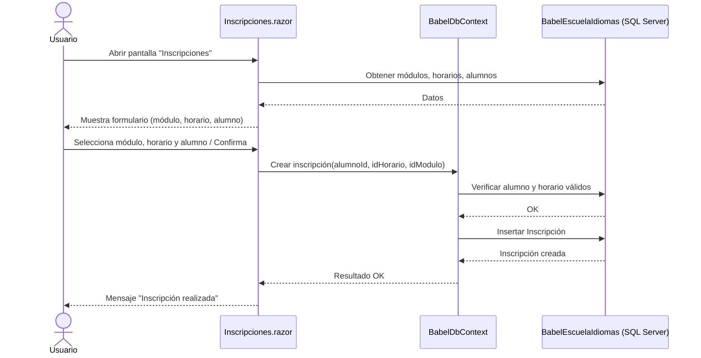

---

## CU-02 – Ejecutar organización automática de cursos

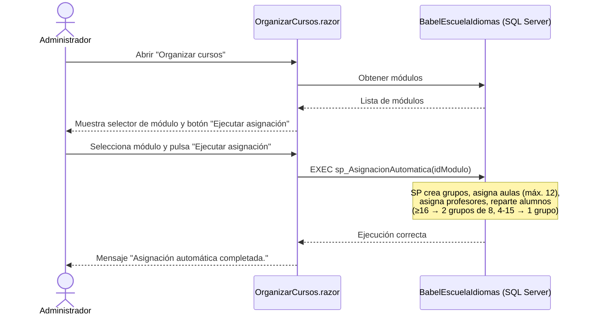

---

## CU-03 – Registrar notas

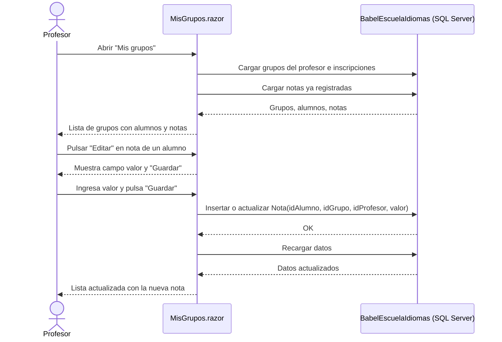

---

## CU-04 – Generar reportes académicos

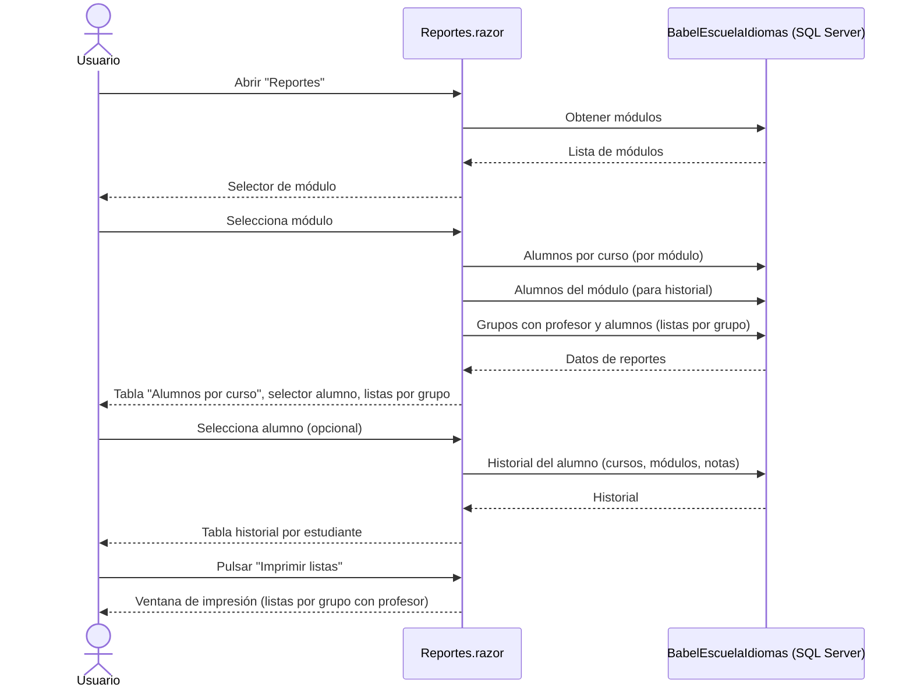

---

## FA-01 – CU-01

*Alumno ya inscrito en ese horario: el sistema detecta la duplicidad y cancela el registro.*

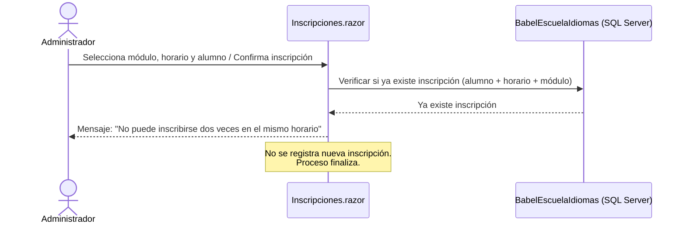

---

## FA-02 – CU-01

*Curso o horario inactivo: el sistema no permite seleccionarlo.*

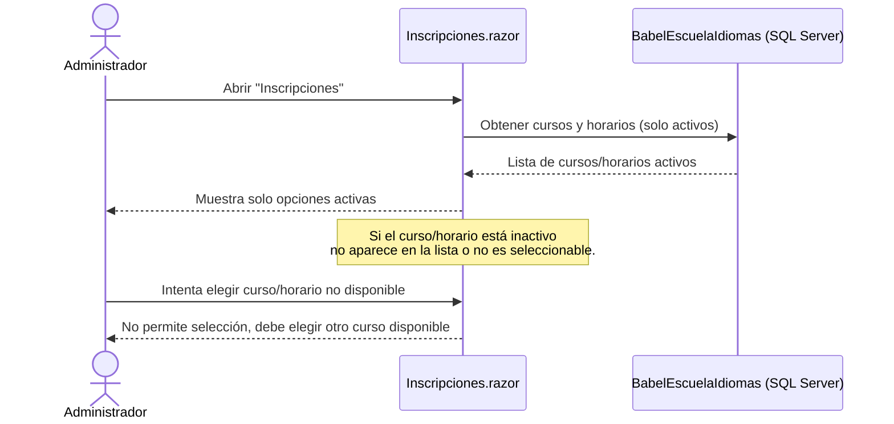

---

## FA-03 – CU-02

*No existen inscripciones en el módulo: el sistema informa y finaliza sin cambios.*

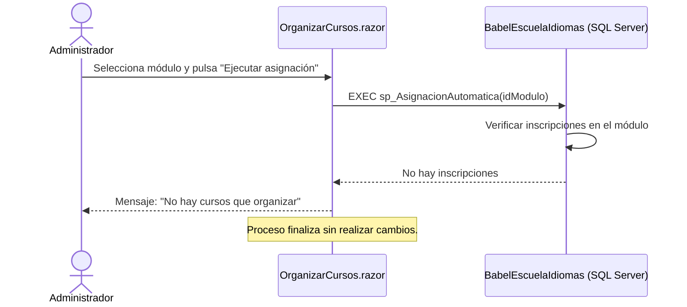

---

## FA-04 – CU-02

*Más cursos activos que aulas: el sistema cierra cursos con menos alumnos hasta 12.*

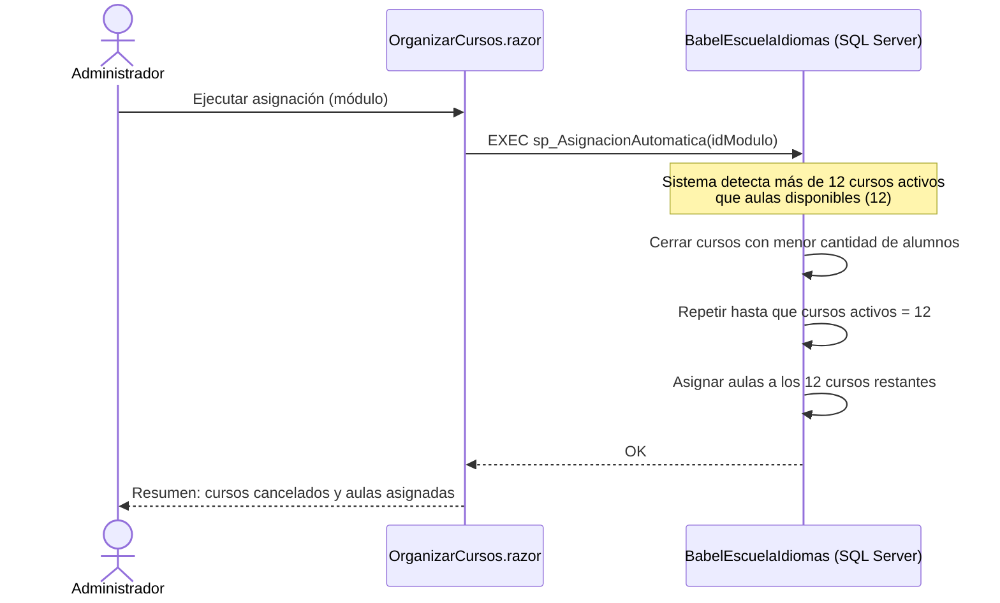

---

## FA-05 – CU-02

*Más de 12 cursos con 16 alumnos: prioridad por nivel (Alto > Medio > Básico).*

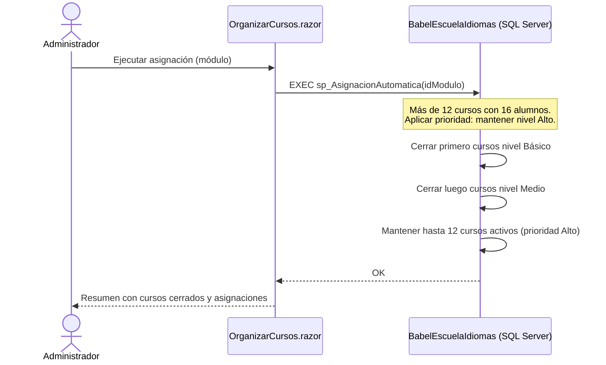

---

## FA-06 – CU-02

*Más de 12 cursos con 16 alumnos y todos son nivel Alto: cierre al azar hasta 12.*

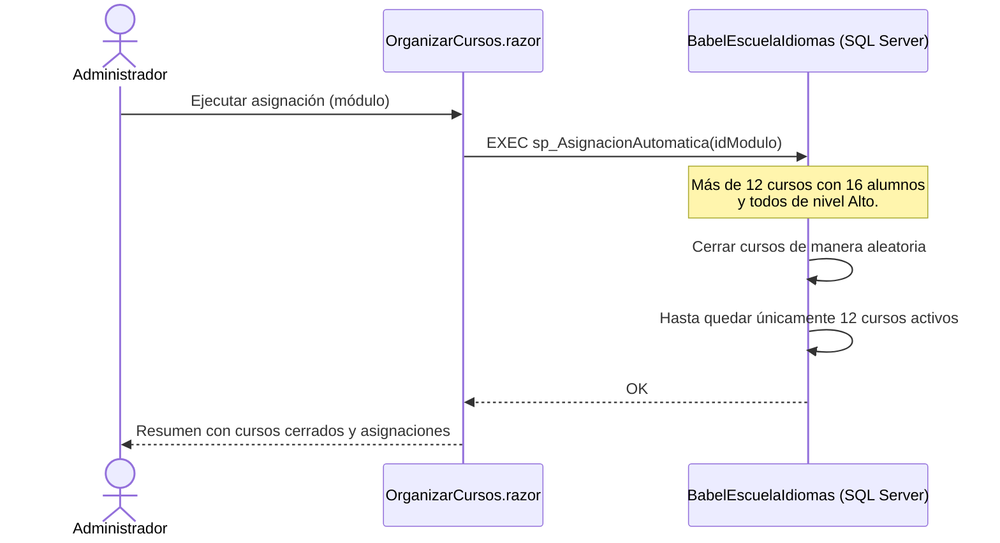

---

## FA-07 – CU-03

*Nota fuera del rango permitido: mensaje de error y no se guarda hasta corregir.*

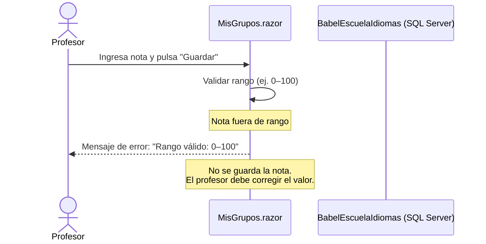

---

## FA-08 – CU-03

*El grupo no tiene alumnos registrados: mensaje informativo y finaliza.*

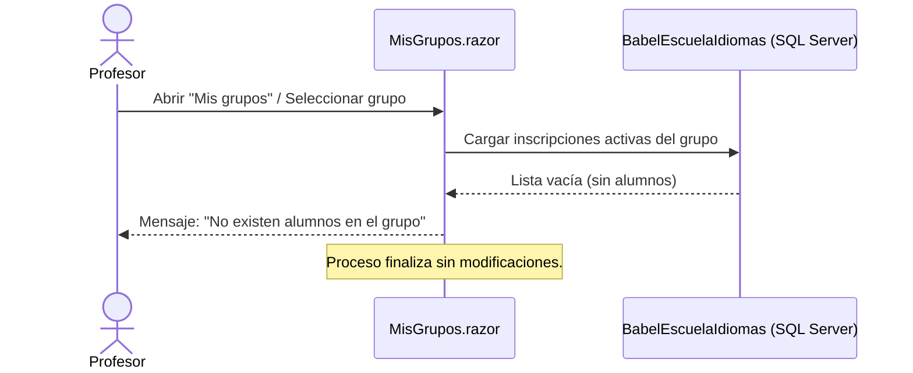

---

## FA-09 – CU-04

*No hay datos para los parámetros del reporte: mensaje informativo y sin resultados.*

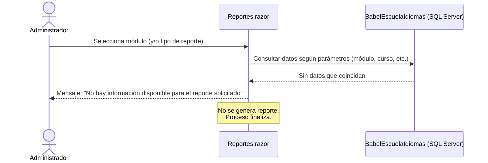
